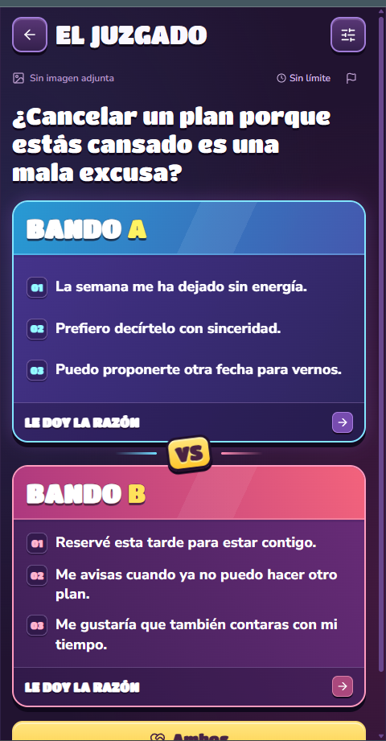
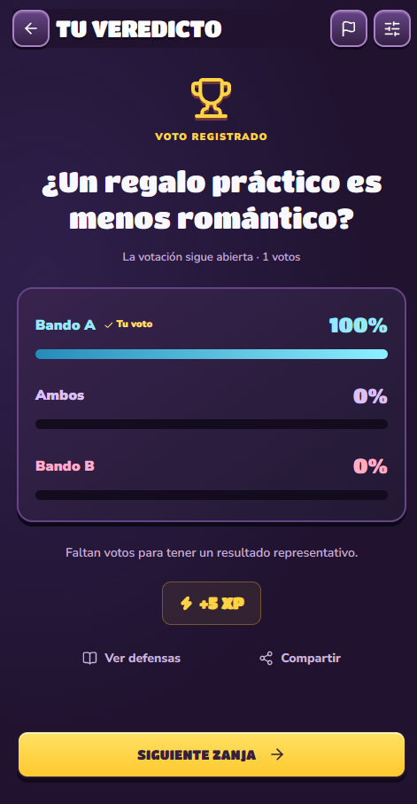

# Estado de pantallas y decisiones

## Criterio de estado y procedencia de capturas

“Terminada” significa implementada en este prototipo, no validada en todos los móviles ni lista para producción. **A medias** se usa donde quedan problemas conocidos o validación crítica. No se dispone de capturas verificadas del último commit: el navegador de previsualización del entorno no estuvo disponible. Las imágenes siguientes son históricas aportadas por el usuario o referencias de otro diseño. No deben usarse para contradecir el código actual. No se ha fabricado una captura de la última versión.

| Pantalla | Estado | Captura disponible |
|---|---|---|
| Inicio / lobby | Terminada en código; QA móvil pendiente | Histórica: `capturas-historicas/image(20260923-225132).png`; anterior a reset DEV |
| Caso del día | Terminada; abre el mismo Juzgado con el caso diario | Sin captura actual independiente; comparte VS |
| Juzgado / VS | A medias: implementación completa, encaje y scroll interno pendientes de verificar | Histórica: `capturas-historicas/43952e56-0b27-441a-84de-89d4c0d0c84b.png`; composición superada |
| Resultado / Tu veredicto | Terminada en código; QA animación pendiente | Histórica: `capturas-historicas/4c5e43e7-146f-4c35-99a8-c403e1fef14d.png`; el resultado actual usa tres tarjetas coloreadas |
| Crear1 · relato y prueba | Terminada en código | Referencia de OTRO diseño: `capturas-historicas/8d11a30b-187f-4c8f-91f6-c46b98303299.png` |
| Crear2 · Defensa de Bando A | Terminada en código; textos largos pueden necesitar desplazamiento | Histórica propia: `capturas-historicas/image(20260924-184500).png`; antes de quitar edición del relato y ampliarlo |
| Crear3 · invitar o responder B aquí | Terminada en código | Referencia de OTRO diseño: `capturas-historicas/f7038a11-4594-40de-8b76-214671e7dad7.png` |
| Compartir invitación | Terminada en código | Referencia de OTRO diseño: `capturas-historicas/e6de1de9-b90a-4ee9-a211-25aac3024554.png` |
| B desde enlace | Terminada en código; probar dos identidades reales | Referencia de OTRO diseño: `capturas-historicas/7b0766f6-af39-4d11-93d3-d9f1cbeef1d6.png` |
| B en este dispositivo, modo solo | Terminada en código | Sin captura propia actual; comparte DefenseFields |
| Esperando a B / listo para publicar | Terminada en código | Sin captura actual |
| Crear4 · audiencia y duración | Terminada en código | Referencia de OTRO diseño: `capturas-historicas/c953a7e0-dd55-4647-a005-d056cecc2cd5.png`; no reproducir su desbordamiento horizontal |
| Caso publicado | Terminada en código; animación de puerta pendiente de inspección real | Histórica parcial propia: `capturas-historicas/image(20260924-195910).png`; icono reemplazado. Referencia externa: `capturas-historicas/c3ddcb7d-7742-435d-ba26-d8a603511178.png` |
| Mis zanjas creadas/votadas | Terminada en código | Sin captura recuperada |
| Perfil / logros | Terminada en código | Sin captura recuperada |
| Filtros / denuncia / ajustes / reglas / login / retirada | A medias: implementados; confirmar portales en móviles reales | Sin captura actual |
| Visor de prueba / subir-cambiar-eliminar | A medias: implementado y validaciones de servidor; falta QA en enlace público/dispositivo | Sin captura actual |
| Lectura de contexto y seis defensas | Terminada en código | Sin captura actual |
| Cola agotada / vacío / errores | Terminada en código | Sin captura actual |
| Panel administrativo de moderación y apelación | Sin empezar | No existe |
| Push / app nativa iOS-Android / offline completo | Sin empezar | No existe |

## Galería histórica propia (no estado final)

### Inicio
.png)

### VS anterior

### Veredicto anterior

### Defensa A antes de la última modificación
.png)

## Estructura y razones

1. **App móvil primero.** Marco de480px máximo y100dvh; en escritorio se conserva la composición de teléfono. Sigue siendo web/PWA, no aplicación nativa. Áreas seguras con env(safe-area-inset-*). No confundir viewport fijo con obligación de cortar contenido accesible.
2. **Inicio, Juzgado, Crear, Mis zanjas y Perfil.** Inicio reúne reto breve, Juzgado, Caso del día y dos tiles. Progreso detallado y logros van al perfil. La acción de crear queda disponible en el centro de la navegación inferior. Evitamos un catálogo de modos en el lobby.
3. **Arena pasa a Juzgado y A jugar pasa a ¡A ZANJAR!** Se conserva `arena` como identificador interno. Se elimina subtítulo bajo el CTA y se reduce el hero. Los títulos del menú comparten Titan One, tamaño responsive, contorno y sombra. El amarillo distingue Crear y la acción principal.
4. **Caso del día sin icono lateral ni cajita inferior.** Pregunta sobre la ilustración; flecha en recuadro grande abajo derecha. También se quitó el icono de la etiqueta Juzgado. Crear conserva el mismo tipo de sombra estructural de los otros tiles.
5. **Quitar permanentemente la coletilla rechazada por el usuario.** No reincorporarla en nuevas pantallas ni textos de onboarding. Se suprimieron etiquetas Amigos/Dilema de ejemplo de la cabecera VS y descripciones inventadas debajo del nombre de cada bando.
6. **VS es pantalla de partida.** Oculta cabecera y navegación del lobby; arriba volver/título/denunciar/filtros. Los filtros pasan a un panel. Pregunta directamente debajo, prueba opcional como miniatura contextual. A y B verticales con tres defensas, VS en la unión, Ambos como tercera tarjeta violeta con presencia propia y saltar centrado abajo.
7. **Voto en tarjetas.** No dock redundante A/Ambos/B. No carrusel de defensas con controles1/2/3: se muestran las tres. Los números visibles son índices de argumentos, no botones. Ambos cuenta en el mismo denominador y tiene los mismos permisos, unicidad y XP.
8. **Ilustración integrada, no pegotes cuadrados.** Energía abstracta en los fondos VS, máscara degradada, cover y color por bando. Se retiraron los guantes de VS. El hero de Inicio conserva su arte histórico de mazo y guantes; la petición de retirarlos se aplicó a los nuevos fondos de VS.
9. **Prueba gráfica opcional.** Si no existe no aparece control vacío en VS. Si existe, miniatura abre visor; disponible también al responder B y en resultados. La prueba del caso editorial de diseño utiliza una captura real aportada como ejemplo, no pretende ser prueba factual de otro conflicto.
10. **Resultado vivo y útil.** Tres tarjetas coherentes con el duelo, propio voto, recuento real y recompensa. Cuenta atrás4s con barra que se vacía, pausable. No sustituye respuesta de servidor por porcentajes inventados para aparentar velocidad.
11. **Creación de cuatro pasos basada en el flujo de referencia, estética nueva.** Relato → tres defensas A → invitar B o escribir B aquí → audiencia/duración y publicar. Se conserva el relato exacto y solo se editan defensas en paso2. No se está usando IA para reescribir u ordenar el relato.
12. **Invitación independiente.** B ve relato/prueba pero no defensas A. Con el flujo nuevo, responder deja listo para que A publique; el reloj comienza al publicar. El modo de escribir ambas partes en el mismo dispositivo se identifica como relato de una sola persona.
13. **Últimos cambios ya en código.** Reset temporal junto al logo; eliminado dictado; textarea inicial más grande; relato readonly más grande en paso2; placeholders ordinales; invitación amarilla primero y B aquí después sin iconos; quitadas las dos confirmaciones del creador; emblema de publicación con puerta que se abre. La confirmación propia de B invitado sigue existiendo.
14. **Menos pantallas prematuras.** Debate semanal por fases, pestaña Actividad y moderación desbloqueada por XP quedaron fuera. No existen logros por votar con la mayoría. No agregar botones decorativos sin función.

## Lo pendiente y las contradicciones a resolver

- **QA móvil real**:320/360/390/430px de ancho; alturas568/667/740/844/932px; Safari iOS, Chrome Android, teclado abierto, zoom y fuente ampliada. No se certifica ausencia absoluta de scroll: el código tiene overflow-y:auto en defensas, creador y resultados. La prioridad del usuario es evitar scroll innecesario, no perder textos largos.
- **Portales**: comprobar filtros, denuncia, prueba, lectura, compartir y cerrar/volver, especialmente al abrir uno desde otro. Se cambió el anclaje a un viewport flex fijo para evitar transformaciones que sacaban el diálogo de pantalla.
- **Navegación**: probar atrás desde cada paso, rama B local, invitación remota pendiente/lista y éxito. La navegación principal usa estado React y query case/invite; no hay una ruta real por pantalla ni integración completa con botón Atrás del sistema operativo.
- **Textos heredados**: `PRODUCT_DECISIONS.md` es una cronología parcial, no especificación actual. Habla de tres pasos, falta de fotos, versión privada, Ambos en unión y defensas paginadas; todo eso fue superado. Metadata aún menciona Arena y un modal antiguo de éxito menciona beta privada; reglas conserva A JUGAR. Limpiar al integrar. Este HANDOFF prevalece para la intención actual; el código manda sobre lo efectivamente implementado.
- **Código heredado**: quedan funciones/estados y CSS antiguos en page.tsx y estilos. No eliminar reglas por parecido sin comprobar precedencia. Exportamos tal cual para no alterar silenciosamente la versión entregada.
- **Reset DEV**: limpia votos del usuario y saltos locales para poder repetir; no borra casos ni reinicia votos de todos. Sigue siendo un control temporal accesible en Inicio. Retirar o proteger con un entorno/rol real de desarrollo.
- **Moderación**: ocultación automática por tres denunciantes distintos, sin consola administrativa ni apelaciones. No confundir estar implementado con tener operación de moderación completa.
- **Audiencia por enlace**: es un caso no listado con identificador impredecible; no un grupo privado con ACL de miembros. Adaptar al modelo del backend real.
- **Autenticación**: depende de Sites; portar sesiones/permisos al servidor real. No aceptar una cabecera de identidad arbitraria enviada por el cliente.
- **Imágenes en público**: confirmar que el caso demo con evidenceUrl está en los datos servidos y que los casos privados subidos resuelven permisos/R2. Una miniatura visible en preview no prueba el funcionamiento fuera de él.
- **Tipografías externas**: se cargan de Google Fonts; si falla la red hay fallback y cambia el encaje. No hay fuentes WOFF locales en este paquete. Para uso offline/alojamiento propio obtener binarios y licencias correspondientes.
- **Accesibilidad**: reducir movimiento y permitir lectura completa están contemplados; falta auditoría con lector de pantalla, focus/teclado y contraste real de texto sobre imagen. Algunos controles son42px y no44px. No afirmar conformidad certificada.
- **No implementado**: backend IA de redacción, dictado (retirado), notificaciones push, sincronización de borrador multidispositivo, offline completo, empaquetado nativo, paginación más allá del límite actual de listados, analítica de producto y gestión administrativa.
- **Prompts y capturas**: no están conservados todos los prompts exactos ni capturas finales. Se entregan las ausencias explícitas y no reconstrucciones presentadas como originales.
